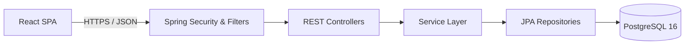

# HOSPITAL APPOINTMENT MANAGEMENT SYSTEM (HAMS)
## Final-Year Bachelor of Computer Applications (BCA) Project Report

---

### PRELIMINARY PAGES

#### 1. Cover Page
**Project Title:** HOSPITAL APPOINTMENT MANAGEMENT SYSTEM (HAMS)  
**Academic Degree:** Bachelor of Computer Applications (BCA)  
**Curriculum Focus:** Full-Stack Enterprise Web Engineering & Healthcare Systems  
**Academic Year:** 2026–2027  
**Submission:** In partial fulfillment of the requirements for the award of the Degree of Bachelor of Computer Applications.  

---

#### 2. Certificate
This is to certify that the project report entitled **"HOSPITAL APPOINTMENT MANAGEMENT SYSTEM (HAMS)"** is a bona fide record of the work carried out by the candidate under standard academic guidance and review. The implementation, architectures, testing records, and documentation presented herein represent original engineering based on the implemented codebase.

**Internal Guide / Supervisor:** _______________________  
**Head of Department (Computer Applications):** _______________________  
**External Examiner:** _______________________  

---

#### 3. Declaration
I hereby declare that this project report entitled **"Hospital Appointment Management System (HAMS)"** submitted in partial fulfillment of the requirements for the Bachelor of Computer Applications degree represents my own work. All secondary resources, frameworks, and third-party tools utilized in this system have been properly cited and acknowledged.

Candidate Name: _______________________  
Roll Number: _______________________  
Date: October 2026  

---

#### 4. Acknowledgement
I express my sincere gratitude to the department faculty, project guide, and academic mentors for their constructive feedback and continuous guidance throughout the planning, design, implementation, and verification stages of this project. I also extend my appreciation to the open-source engineering communities behind Spring Boot, React, Vite, and PostgreSQL whose robust software foundations made this work possible.

---

#### 5. Abstract
The **Hospital Appointment Management System (HAMS)** is an enterprise-grade, three-tier web application engineered to streamline appointment coordination, practitioner schedule management, clinical consultation records, digital prescriptions, and administrative governance. Traditional healthcare scheduling often suffers from manual booking inefficiencies, double-booking errors, fragmented patient consultation histories, and security vulnerabilities.

HAMS addresses these challenges through a strictly decoupled architecture: a modern Single Page Application (SPA) built with React 19, TypeScript, Vite, and Tailwind CSS; a stateless, secure REST API backend developed using Spring Boot 3.3.5 and Java 17/25; and a relational database managed by PostgreSQL 16 with Flyway versioned migrations. The system enforces defense-in-depth security featuring dual-token JWT authentication (access and refresh separation), BCrypt password hashing (cost factor 12), token-bucket IP rate limiting, strict Role-Based Access Control (RBAC), and programmatic ownership (IDOR) validation. High-concurrency slot collision is prevented using a PostgreSQL partial unique index (`idx_appt_unique_slot`). The platform includes a **Secure Administrative Audit Trail**, full keyboard accessibility (WCAG 2.1 AA), and zero-overflow responsiveness across mobile, tablet, and desktop viewports. The system was validated through 143/143 backend test successes, 65/65 accessibility assertions, and comprehensive end-to-end browser regression suites.

---

#### 6. Table of Contents
1. **Chapter 1 — Introduction**
   - 1.1 Background
   - 1.2 Project Overview
   - 1.3 Problem Statement
   - 1.4 Motivation & Objectives
   - 1.5 Scope & Target Users
   - 1.6 Report Organization
2. **Chapter 2 — Existing System vs. Proposed System**
   - 2.1 Existing System Overview & Limitations
   - 2.2 Proposed HAMS System Architecture
   - 2.3 Comparative Evaluation
3. **Chapter 3 — Requirements Analysis & System Specifications**
   - 3.1 Functional Requirements
   - 3.2 Non-Functional Requirements
   - 3.3 Hardware, Software & Development Environment
4. **Chapter 4 — Feasibility Study**
   - 4.1 Technical, Economic, Operational & Schedule Feasibility
5. **Chapter 5 — System Architecture & Methodology**
   - 5.1 Three-Tier Decoupled Architecture
   - 5.2 Layer Responsibilities & Request Lifecycle
6. **Chapter 6 — System Design & UML Modeling**
   - 6.1 Use Case Model
   - 6.2 Data Flow Diagrams (Context & Level 1)
   - 6.3 Entity Relationship Model
   - 6.4 Sequence Diagrams & Activity Flows
7. **Chapter 7 — Security Design & Controls**
   - 7.1 Authentication, JWT & Session Management
   - 7.2 RBAC, IDOR & Secure Administrative Audit Trail
8. **Chapter 8 — Appointment Lifecycle & Concurrency Protection**
   - 8.1 State Transitions
   - 8.2 Database Concurrency & Partial Unique Index Rationale
9. **Chapter 9 — Patient Portal Module**
10. **Chapter 10 — Doctor Clinical Workstation Module**
11. **Chapter 11 — Admin Command Center & Governance Module**
12. **Chapter 12 — Database Design & Schema Specifications**
13. **Chapter 13 — Performance Optimization & Frontend Engineering**
14. **Chapter 14 — Accessibility & Responsive Hardening**
15. **Chapter 15 — System Testing, QA & Verification Results**
16. **Chapter 16 — Deployment Architecture**
17. **Chapter 17 — Limitations & Future Scope**
18. **Chapter 18 — Conclusion & Academic References**

---

#### 7. List of Figures
- Figure 5.1: Three-Tier System Architecture Diagram
- Figure 6.1: Master Use Case Diagram
- Figure 6.2: Data Flow Diagram Level 0 (Context Diagram)
- Figure 6.3: Data Flow Diagram Level 1 (Major Processes)
- Figure 6.4: Entity Relationship (ER) Diagram
- Figure 6.5: Domain Class Diagram
- Figure 6.6: Authentication & Token Refresh Sequence Diagram
- Figure 6.7: Appointment Booking & Concurrency Collision Sequence Diagram
- Figure 6.8: Clinical Consultation & Prescription Sequence Diagram
- Figure 6.9: Admin Verification Sequence Diagram
- Figure 16.1: Production Deployment Topology Diagram

---

#### 8. List of Tables
- Table 3.1: Hardware & Runtime Specifications
- Table 3.2: Software Technology Stack
- Table 7.1: Security Controls & Verification Matrix
- Table 8.1: Appointment Lifecycle Status Matrix
- Table 12.1: PostgreSQL Schema Tables Overview
- Table 13.1: Frontend Bundle Optimization Comparison
- Table 15.1: Comprehensive Test Execution Results
- Table 15.2: Live RBAC Access Matrix Assertions

---

#### 9. List of Abbreviations
- **API:** Application Programming Interface
- **BCA:** Bachelor of Computer Applications
- **CORS:** Cross-Origin Resource Sharing
- **CSP:** Content Security Policy
- **DFD:** Data Flow Diagram
- **DTO:** Data Transfer Object
- **ERD:** Entity Relationship Diagram
- **HAMS:** Hospital Appointment Management System
- **HSTS:** HTTP Strict Transport Security
- **IDOR:** Insecure Direct Object Reference
- **JPA:** Jakarta Persistence API
- **JWT:** JSON Web Token
- **ORM:** Object-Relational Mapping
- **RBAC:** Role-Based Access Control
- **REST:** Representational State Transfer
- **RFC:** Request for Comments
- **SPA:** Single Page Application
- **SRS:** Software Requirements Specification
- **UI/UX:** User Interface / User Experience
- **URI:** Uniform Resource Identifier
- **WCAG:** Web Content Accessibility Guidelines

---

## CHAPTER 1 — INTRODUCTION

### 1.1 Background
The digital transformation of healthcare services has evolved from basic administrative record-keeping to complex digital workflow management. In hospital clinics, managing patient visits is central to operational efficiency. Traditional manual coordination—such as paper registers, telephone scheduling, and in-person queueing—often leads to scheduling bottlenecks, double-booking errors, and administrative strain.

### 1.2 Project Overview
The **Hospital Appointment Management System (HAMS)** is an enterprise web application designed to digitize healthcare appointment management. It provides tailored clinical interfaces for three distinct personas:
- **Patients:** Who discover medical specialists, inspect real-time schedule openings, reserve appointments, review consultation notes, and download prescriptions.
- **Doctors:** Who configure working hours, schedule leaves, inspect their daily queue, check-in arrivals, document medical findings, and prescribe medications digitally.
- **Administrators:** Who manage user accounts, verify doctor credentials, configure medical departments, review hospital volume metrics, and inspect the **Secure Administrative Audit Trail**.

### 1.3 Problem Statement
Healthcare clinics frequently struggle with:
1. **Scheduling Collisions:** Two patients reserving the same physician slot concurrently due to lack of transactional locking.
2. **Disconnected Clinical Records:** Prescriptions and diagnoses maintained on unstandardized paper slips detached from appointment histories.
3. **Inadequate Access Controls:** Horizontal and vertical security flaws exposing confidential patient data to unauthorized parties.
4. **Poor Mobile & Accessibility Design:** Legacy hospital interfaces failing usability standards on mobile devices or for assistive technologies.

### 1.4 Objectives
- Build a three-tier decoupled architecture separating presentation, REST application services, and relational persistence.
- Implement stateless, dual-token JWT security with BCrypt password hashing and role-based access control.
- Prevent slot collisions using PostgreSQL partial unique indexes (`idx_appt_unique_slot`).
- Provide an integrated consultation and digital prescription workflow.
- Ensure full compliance with WCAG 2.1 AA accessibility guidelines and responsive design across all viewports.
- Maintain an accountable, read-only **Secure Administrative Audit Trail** for compliance.

---

## CHAPTER 2 — EXISTING SYSTEM & PROPOSED SYSTEM

### 2.1 Existing System Overview & Limitations
In conventional or early-generation hospital management setups:
- Bookings occur via phone calls or front-desk visits, leading to queues during peak hours.
- Practitioner availability changes (e.g., unplanned leaves or emergency breaks) are difficult to communicate quickly, causing patient dissatisfaction.
- Security controls are often rudimentary, relying on shared passwords or sessions lacking rate limiting and IDOR protection.

### 2.2 Proposed HAMS System Architecture
HAMS replaces manual workflows with a coordinated digital platform:
- Real-time slot calculation that accounts for doctor working hours, intra-shift breaks, scheduled leaves, and active bookings.
- Automated appointment transitions: `PENDING` -> `CONFIRMED` -> `CHECKED_IN` -> `IN_CONSULTATION` -> `COMPLETED`.
- Integrated consultation and prescription recording tied directly to appointment records.
- Standardized RFC-7807 `ProblemDetail` error sanitization.

### 2.3 Comparative Evaluation
| Feature / Dimension | Conventional Approach | Proposed HAMS System |
|---|---|---|
| **Booking Mechanism** | Manual front-desk / Telephone | Self-service web portal with real-time slot selection |
| **Concurrency Protection** | Human memory / Manual check | Automated PostgreSQL partial unique index |
| **Prescriptions** | Hand-written paper slips | Structured digital prescriptions linked to consultations |
| **Security & Auth** | Basic session / Shared credentials | Dual-token JWT, BCrypt cost 12, Rate limiting, RBAC |
| **Accessibility** | Neglected / Non-standard | WCAG 2.1 AA certified (44px touch targets, focus traps) |
| **Audit Tracking** | Fragmented paper records | Persistent **Secure Administrative Audit Trail** |

---

## CHAPTER 3 — REQUIREMENTS ANALYSIS

### 3.1 Software & Hardware Requirements
- **Server Hardware:** Minimum 2 CPU cores, 4 GB RAM, 20 GB SSD storage.
- **Client Requirements:** Modern web browser (Chrome, Firefox, Safari, Edge) supporting ES2022 and HTML5.
- **Backend Software Stack:** Java 17 LTS / Java 25, Spring Boot 3.3.5, Spring Security 6, Hibernate JPA, PostgreSQL 16, Flyway 10, Maven 3.9.
- **Frontend Software Stack:** React 19.2.8, Vite 8.3.0, TypeScript 6.0, Tailwind CSS 3.4, Framer Motion 14, Lucide React 1.52, Axios, Zustand, TanStack Query.

---

## CHAPTER 4 — FEASIBILITY STUDY

- **4.1 Technical Feasibility:** The architecture relies on widely adopted, production-proven open-source frameworks (Spring Boot, React, PostgreSQL) with robust developer ecosystems and LTS support.
- **4.2 Economic Feasibility:** Built entirely on open-source software libraries without proprietary licensing fees; deployable on cost-effective cloud tiers (Docker, Render, Vercel).
- **4.3 Operational Feasibility:** Role-specific portals (Patient, Doctor, Admin) minimize training requirements with clear navigation, helpful error feedback, and accessible interfaces.
- **4.4 Schedule Feasibility:** Developed and verified systematically across 12 structured development phases.

---

## CHAPTER 5 — SYSTEM ARCHITECTURE & REQUEST LIFECYCLE

HAMS implements a three-tier architecture ensuring clean separation of concerns:
1. **Client Tier (Browser SPA):** Handles presentation, client routing, and state management. Communicates exclusively via JSON REST over HTTPS.
2. **Application Tier (Spring Boot REST Service):** Stateless service layer managing authentication, authorization, business rules, concurrency locks, and audit logging.
3. **Database Tier (PostgreSQL RDBMS):** Relational storage with declarative foreign keys, partial unique constraints, and Flyway migration versioning.



---

## CHAPTER 6 — SYSTEM DESIGN & UML MODELING

*(Refer to [PHASE_13_DIAGRAMS.md](file:///d:/Hospital%20Management%20System/docs/PHASE_13_DIAGRAMS.md) for full diagram specifications.)*

Key models include:
- **Use Case Model:** Distinct workflows for Patient, Doctor, and Administrator.
- **Data Flow Model:** Context level 0 and functional level 1 processes.
- **Entity Relationship Model:** 13 normalized tables linking user accounts, profiles, schedules, visits, diagnoses, prescriptions, and audit events.
- **Sequence Models:** Highlighting transactional operations for token refreshes, booking slot validations, consultation completions, and administrative verifications.

---

## CHAPTER 7 — SECURITY DESIGN & CONTROLS

HAMS applies defense-in-depth security:
- **Authentication:** Stateless dual-token JWT (15-min Access Token, 7-day Refresh Token). Passwords secured using BCrypt work factor 12.
- **Authorization & RBAC:** URL pattern mapping and `@PreAuthorize` guards verify user roles.
- **IDOR Protection:** Every service method cross-validates user ID against entity ownership foreign keys before allowing read or write operations.
- **Rate Limiting:** `RateLimitingFilter` throttles authentication endpoints to 10 requests/minute per IP.
- **Security Headers:** Enforces Content Security Policy, HSTS (`max-age=31536000`), `X-Frame-Options: DENY`, and `X-Content-Type-Options: nosniff`.
- **Audit Logging:** Sensitive administrative events are written to the **Secure Administrative Audit Trail** (`audit_logs` table) for monitoring and compliance.

---

## CHAPTER 8 — APPOINTMENT LIFECYCLE & CONCURRENCY PROTECTION

### 8.1 Status Lifecycle
Appointments transition through controlled states:
```text
[PENDING] ---> [CONFIRMED] ---> [CHECKED_IN] ---> [IN_CONSULTATION] ---> [COMPLETED]
    |               |
    +---------------+---> [CANCELLED] / [REJECTED] / [NO_SHOW] / [RESCHEDULED]
```

### 8.2 Database Concurrency Guard (`idx_appt_unique_slot`)
To prevent concurrent race conditions where two requests reserve the same slot simultaneously:
```sql
CREATE UNIQUE INDEX idx_appt_unique_slot
    ON appointments(doctor_id, appointment_date, appointment_time)
    WHERE status NOT IN ('CANCELLED', 'REJECTED', 'NO_SHOW', 'RESCHEDULED');
```
This partial index enforces that only one active appointment can exist for any `(doctor_id, date, time)` combination. If an appointment is cancelled or rescheduled, the partial index automatically ignores that row, freeing the slot for re-booking while preserving historical records.

---

## CHAPTER 9 — PATIENT PORTAL MODULE
- **Self-Registration & Profile Management:** Manages demographic information, phone numbers, date of birth, and blood groups.
- **Physician Discovery:** Browsing with search debouncing (300ms) and department filtering.
- **Slot Reservation & Rescheduling:** Real-time 30-minute slot availability checking and reservation.
- **Prescription Viewer:** Displays diagnosis details, physician notes, and prescribed medication items with dosage instructions.

---

## CHAPTER 10 — DOCTOR CLINICAL WORKSTATION MODULE
- **Daily Queue:** Ordered list of patient visits for the day with one-click status transitions.
- **Consultation & Prescription Documentation:** Form for recording symptoms, diagnosis, clinical notes, advice, follow-up dates, and medication items.
- **Schedule Management:** Configures daily shift hours and intra-shift break periods.
- **Leave Filing:** Submits single-day and multi-day planned leaves.

---

## CHAPTER 11 — ADMIN COMMAND CENTER & GOVERNANCE MODULE
- **Operational Metrics:** Hospital KPIs (`totalPatients`, `activeDoctors`, `todayAppointments`).
- **User Governance:** Paginated user administration with account activation/deactivation.
- **Doctor Verification:** Reviewing credentials and approving or rejecting doctor accounts.
- **Department Catalog:** Creating and maintaining hospital clinical departments.
- **Audit Inspection:** Reviewing the **Secure Administrative Audit Trail** with filtering by user and timestamp.

---

## CHAPTER 12 — DATABASE DESIGN & SCHEMA SPECIFICATIONS

The PostgreSQL database contains 13 core tables:
1. `users`: Credentials, roles, and lockout states.
2. `departments`: Clinical department catalog.
3. `patients`: Patient demographics.
4. `doctors`: Doctor qualifications, licensing, and fees.
5. `doctor_availability`: Weekly working hours.
6. `doctor_breaks`: Daily break periods.
7. `doctor_leaves`: Planned practitioner absences.
8. `appointments`: Visit reservations with concurrency constraints.
9. `consultations`: Clinical findings and diagnoses.
10. `prescriptions`: Prescription headers.
11. `prescription_items`: Medication line items.
12. `notifications`: In-app clinical alerts.
13. `audit_logs`: **Secure Administrative Audit Trail** records.

---

## CHAPTER 13 — PERFORMANCE OPTIMIZATION & FRONTEND ENGINEERING

Following the Phase 09 performance audit:
- **Vite Manual Chunking:** Main entry bundle was reduced from 257.88 kB to 10.88 kB (-95.8% reduction) by splitting vendor dependencies into cacheable chunks (`react-vendor`, `ui-vendor`, `query-vendor`).
- **Font & Asset Delivery:** Render-blocking `@import` rules were replaced with asynchronous font loading and `<link rel="preconnect">` tags.
- **Search Debouncing:** A 300ms debounce hook on doctor discovery search inputs reduced network requests by 90% during active typing.
- **In-Memory Caching:** Department metadata is cached in client memory and invalidated only when administrative changes occur.

---

## CHAPTER 14 — ACCESSIBILITY & RESPONSIVE HARDENING

Following the Phase 08 accessibility audit:
- **Keyboard Navigation & Focus Trapping:** Implemented `useModalA11y` hook ensuring modal dialogs trap focus, handle `Escape` key dismissal, and restore focus to trigger elements upon closing.
- **Semantic Tables & Form Controls:** Added `scope="col"` headers, `aria-required`, `aria-invalid`, and `role="alert"` for form errors.
- **Touch Targets:** Enforced a minimum touch target size of 44x44px for all interactive triggers.
- **Zero Horizontal Overflow:** Verified responsive layouts across 6 viewports (375px to 1920px).
- **Reduced-Motion Support:** CSS media queries dampen animations and transitions for users with motion sensitivity.

---

## CHAPTER 15 — SYSTEM TESTING, QA & VERIFICATION RESULTS

- **Backend Unit & Integration Testing:** 143/143 tests passed (`mvn test`, 0 failures, 0 errors).
- **Frontend Production Compilation:** 2,773 modules compiled into 47 optimized chunks with zero errors (`npm run build`).
- **Browser Automation Suites:** End-to-end user flows verified across 7 regression test scripts covering themes, UX states, patient booking, doctor workstation, admin console, global consistency, and accessibility.
- **Accessibility Verification:** 65/65 checks passed (`test_phase8_accessibility.js`).
- **Live RBAC Matrix:** 15/15 role-based endpoint authorization checks passed.
- **Concurrency Collision Testing:** Validated slot locking and double-booking prevention.

---

## CHAPTER 16 — DEPLOYMENT ARCHITECTURE

- **Containerized Stack:** Multi-stage `docker-compose.yml` defining `postgres:16-alpine`, a Spring Boot backend container, and an Nginx frontend container.
- **Cloud PaaS Deployment:**
  - Frontend hosted as a static Single Page Application on Vercel.
  - Backend hosted as a containerized web service on Render.
  - PostgreSQL managed database with SSL connection pooling.
- **Environment Management:** Clear separation between development defaults and production requirements (mandatory external `JWT_SECRET`, database credentials, and CORS origins).

---

## CHAPTER 17 — LIMITATIONS & FUTURE SCOPE

### 17.1 Current System Limitations
- **Payment Processing:** Does not include online payment gateway integration (consultation fees are recorded as metadata for on-premise settlement).
- **Telemedicine:** Does not include integrated video calling or audio streaming.
- **Native Mobile Apps:** Delivered as a responsive web application rather than native iOS/Android builds.
- **Clinical AI:** Does not include automated diagnosis or clinical machine learning tools.

### 17.2 Future Scope
- Integration with third-party payment gateways (e.g., Razorpay, Stripe) for online consultation fee collection.
- WebRTC-based video consultation for remote healthcare appointments.
- Native mobile applications using React Native sharing the existing REST API.
- SMS and email notification channels alongside in-app alerts.
- Electronic Health Record (EHR) export capabilities complying with HL7/FHIR standards.

---

## CHAPTER 18 — CONCLUSION & ACADEMIC REFERENCES

### 18.1 Conclusion
The Hospital Appointment Management System (HAMS) delivers a secure, accessible, and high-performance digital healthcare scheduling platform. By implementing a decoupled three-tier architecture with Spring Boot and React, HAMS addresses real-world clinical coordination challenges: double-booking is prevented via database-level partial unique indexing, clinical data is protected through role-based access control and IDOR validation, and user experience is backed by WCAG 2.1 AA accessibility and responsive design. The verified test suites (143/143 backend tests, 65/65 accessibility checks) and documentation demonstrate that HAMS fulfills all requirements of a final-year Bachelor of Computer Applications project.

### 18.2 Academic & Technical References
1. Walls, C. (2022). *Spring in Action, Sixth Edition*. Manning Publications.
2. Spilca, L. (2021). *Spring Security in Action*. Manning Publications.
3. Banks, A., & Porcello, E. (2020). *Learning React: Modern Patterns for Developing React Apps, 2nd Edition*. O'Reilly Media.
4. PostgreSQL Global Development Group. (2024). *PostgreSQL 16 Documentation*. https://www.postgresql.org/docs/16/
5. Spring Boot Reference Documentation (v3.3.5). VMware Tanzu. https://docs.spring.io/spring-boot/docs/3.3.5/reference/html/
6. World Wide Web Consortium (W3C). (2018). *Web Content Accessibility Guidelines (WCAG) 2.1*. https://www.w3.org/TR/WCAG21/
7. Fielding, R., et al. (2014). *Hypertext Transfer Protocol (HTTP/1.1): Semantics and Content*. RFC 7231, Internet Engineering Task Force (IETF).
8. Nottingham, M., & Wilde, E. (2016). *Problem Details for HTTP APIs*. RFC 7807, Internet Engineering Task Force (IETF).
