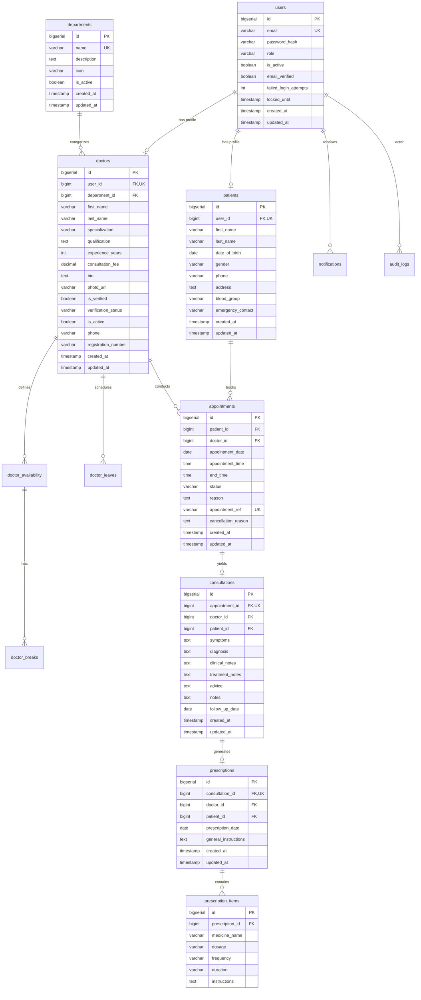

# HAMS Phase 12 — Database Schema Documentation

**Project:** Hospital Appointment Management System (HAMS)  
**Database Engine:** PostgreSQL 16  
**Migration Tool:** Flyway (`V1` to `V7`)  
**Status:** Verified Production Schema  

---

## 1. Schema Entity Relationship Overview



---

## 2. Table-by-Table Technical Specifications

### 2.1 Table: `users`
- **Purpose:** Primary authentication credentials, account lock state, and system RBAC role definitions.
- **Primary Key:** `id` (BIGSERIAL)
- **Columns:**
  - `email` (VARCHAR(255), UNIQUE, NOT NULL): User identity used for JWT authentication.
  - `password_hash` (VARCHAR(255), NOT NULL): BCrypt hashed secret (cost factor 12).
  - `role` (VARCHAR(20), NOT NULL): Enforced via check constraint `CHECK (role IN ('PATIENT','DOCTOR','ADMIN'))`.
  - `is_active` (BOOLEAN, NOT NULL, DEFAULT TRUE): Account administrative status.
  - `email_verified` (BOOLEAN, NOT NULL, DEFAULT FALSE): Email confirmation state.
  - `failed_login_attempts` (INTEGER, NOT NULL, DEFAULT 0): Brute-force tracking counter.
  - `locked_until` (TIMESTAMP): Account lockout expiration timestamp.
  - `created_at`, `updated_at` (TIMESTAMP): JPA auditing timestamps.
- **Indexes:** `idx_users_email` (ON `email`), `idx_users_role` (ON `role`).

### 2.2 Table: `departments`
- **Purpose:** Medical specialties and clinical divisions within the hospital.
- **Primary Key:** `id` (BIGSERIAL)
- **Columns:**
  - `name` (VARCHAR(100), UNIQUE, NOT NULL): Department name (e.g., Cardiology, Neurology).
  - `description` (TEXT): Clinical overview of the department.
  - `icon` (VARCHAR(50)): Lucide icon identifier reference.
  - `is_active` (BOOLEAN, NOT NULL, DEFAULT TRUE): Visibility status.
  - `created_at`, `updated_at` (TIMESTAMP).

### 2.3 Table: `patients`
- **Purpose:** Demographic and clinical identification information for patients.
- **Primary Key:** `id` (BIGSERIAL)
- **Foreign Keys:** `user_id` -> `users(id)` ON DELETE CASCADE (UNIQUE constraint).
- **Columns:**
  - `first_name`, `last_name` (VARCHAR(100), NOT NULL).
  - `date_of_birth` (DATE).
  - `gender` (VARCHAR(10), CHECK `IN ('MALE','FEMALE','OTHER')`).
  - `phone` (VARCHAR(20)).
  - `address` (TEXT).
  - `blood_group` (VARCHAR(5)): e.g., 'O+', 'A-', 'AB+'.
  - `emergency_contact` (VARCHAR(20)).
  - `created_at`, `updated_at` (TIMESTAMP).
- **Indexes:** `idx_patients_user_id` (ON `user_id`).

### 2.4 Table: `doctors`
- **Purpose:** Professional medical practitioner profiles, licensing, and credentials.
- **Primary Key:** `id` (BIGSERIAL)
- **Foreign Keys:**
  - `user_id` -> `users(id)` ON DELETE CASCADE (UNIQUE).
  - `department_id` -> `departments(id)` ON DELETE SET NULL.
- **Columns:**
  - `first_name`, `last_name` (VARCHAR(100), NOT NULL).
  - `specialization` (VARCHAR(150), NOT NULL).
  - `qualification` (TEXT): Degrees and board certifications (e.g., MBBS, MD).
  - `experience_years` (INTEGER).
  - `consultation_fee` (DECIMAL(10,2)).
  - `bio` (TEXT), `photo_url` (VARCHAR(500)).
  - `is_verified` (BOOLEAN, NOT NULL, DEFAULT FALSE).
  - `verification_status` (VARCHAR(20), NOT NULL, DEFAULT 'PENDING'): Added in `V3` (`PENDING`, `APPROVED`, `REJECTED`).
  - `is_active` (BOOLEAN, NOT NULL, DEFAULT TRUE).
  - `phone` (VARCHAR(20)), `registration_number` (VARCHAR(255)).
  - `created_at`, `updated_at` (TIMESTAMP).
- **Indexes:** `idx_doctors_user_id`, `idx_doctors_department`, `idx_doctors_specialization`.

### 2.5 Table: `doctor_availability`
- **Purpose:** Recurring weekly practice schedules per doctor.
- **Primary Key:** `id` (BIGSERIAL)
- **Foreign Keys:** `doctor_id` -> `doctors(id)` ON DELETE CASCADE.
- **Columns:**
  - `day_of_week` (VARCHAR(10), NOT NULL): `MONDAY` through `SUNDAY`.
  - `start_time` (TIME, NOT NULL), `end_time` (TIME, NOT NULL).
  - `slot_duration_mins` (INTEGER, NOT NULL, DEFAULT 30).
  - `is_active` (BOOLEAN, NOT NULL, DEFAULT TRUE).
  - `created_at`, `updated_at` (TIMESTAMP).
- **Constraints:** UNIQUE (`doctor_id`, `day_of_week`).

### 2.6 Table: `doctor_breaks`
- **Purpose:** Daily intra-shift breaks (lunch, rounds) within availability periods.
- **Primary Key:** `id` (BIGSERIAL)
- **Foreign Keys:** `availability_id` -> `doctor_availability(id)` ON DELETE CASCADE.
- **Columns:** `start_time` (TIME, NOT NULL), `end_time` (TIME, NOT NULL), `created_at` (TIMESTAMP).

### 2.7 Table: `doctor_leaves`
- **Purpose:** Planned practitioner absences preventing slot bookings.
- **Primary Key:** `id` (BIGSERIAL)
- **Foreign Keys:** `doctor_id` -> `doctors(id)` ON DELETE CASCADE.
- **Columns:**
  - `leave_date` (DATE, NOT NULL): Single date fallback.
  - `start_date` (DATE), `end_date` (DATE): Date range support added in `V4`.
  - `reason` (TEXT).
  - `created_at`, `updated_at` (TIMESTAMP).
- **Indexes:** `idx_doctor_leaves_date` (ON `doctor_id, leave_date`).

### 2.8 Table: `appointments`
- **Purpose:** Clinical visit reservations linking patients and doctors.
- **Primary Key:** `id` (BIGSERIAL)
- **Foreign Keys:**
  - `patient_id` -> `patients(id)`.
  - `doctor_id` -> `doctors(id)`.
- **Columns:**
  - `appointment_date` (DATE, NOT NULL).
  - `appointment_time` (TIME, NOT NULL).
  - `end_time` (TIME): Computed based on doctor slot duration.
  - `status` (VARCHAR(20), NOT NULL, DEFAULT 'PENDING'): Valid statuses:
    `PENDING`, `CONFIRMED`, `CHECKED_IN`, `IN_CONSULTATION`, `COMPLETED`, `CANCELLED`, `REJECTED`, `NO_SHOW`, `RESCHEDULED`.
  - `reason` (TEXT): Chief complaint stated by patient.
  - `appointment_ref` (VARCHAR(20), UNIQUE): Public reference code (e.g. `APT-20261009-ABC1`).
  - `cancellation_reason` (TEXT).
  - `created_at`, `updated_at` (TIMESTAMP).
- **Indexes & Concurrency Guard:**
  - `idx_appt_doctor_date` ON (`doctor_id, appointment_date`)
  - `idx_appt_patient` ON (`patient_id`)
  - `idx_appt_status` ON (`status`)
  - **Critical Partial Unique Index:**
    ```sql
    CREATE UNIQUE INDEX idx_appt_unique_slot
        ON appointments(doctor_id, appointment_date, appointment_time)
        WHERE status NOT IN ('CANCELLED', 'REJECTED', 'NO_SHOW', 'RESCHEDULED');
    ```

#### The `idx_appt_unique_slot` Concurrency Rationale
In high-concurrency healthcare environments, two patients might attempt to reserve the same doctor slot at the exact same millisecond. Application-level verification queries (`existsActiveAppointment`) can suffer from race conditions under standard isolation levels. 

The partial index `idx_appt_unique_slot` delegates the invariant directly to the PostgreSQL B-Tree engine. It guarantees that no two rows with active states can share `(doctor_id, appointment_date, appointment_time)`. If an appointment is cancelled, rejected, marked as no-show, or rescheduled, the partial index automatically ignores that row, liberating the slot for immediate rebooking without requiring row deletions.

### 2.9 Table: `consultations`
- **Purpose:** Post-visit medical findings, diagnoses, and physician recommendations.
- **Primary Key:** `id` (BIGSERIAL)
- **Foreign Keys:**
  - `appointment_id` -> `appointments(id)` ON DELETE CASCADE (UNIQUE).
  - `doctor_id` -> `doctors(id)` (Added in `V6`).
  - `patient_id` -> `patients(id)` (Added in `V6`).
- **Columns:**
  - `symptoms` (TEXT), `diagnosis` (TEXT, NOT NULL), `clinical_notes` (TEXT).
  - `treatment_notes` (TEXT), `advice` (TEXT), `notes` (TEXT).
  - `follow_up_date` (DATE).
  - `created_at`, `updated_at` (TIMESTAMP).

### 2.10 Table: `prescriptions`
- **Purpose:** Formal medication prescription records tied to consultations.
- **Primary Key:** `id` (BIGSERIAL)
- **Foreign Keys:**
  - `consultation_id` -> `consultations(id)` ON DELETE CASCADE (UNIQUE).
  - `doctor_id` -> `doctors(id)`, `patient_id` -> `patients(id)` (Added in `V6`).
- **Columns:** `prescription_date` (DATE), `general_instructions` (TEXT), `created_at`, `updated_at` (TIMESTAMP).

### 2.11 Table: `prescription_items`
- **Purpose:** Individual pharmaceutical dosages prescribed in a prescription.
- **Primary Key:** `id` (BIGSERIAL)
- **Foreign Keys:** `prescription_id` -> `prescriptions(id)` ON DELETE CASCADE.
- **Columns:**
  - `medicine_name` (VARCHAR(200), NOT NULL).
  - `dosage` (VARCHAR(100)): e.g., '500mg'.
  - `frequency` (VARCHAR(100)): e.g., 'Twice daily after meals'.
  - `duration` (VARCHAR(100)): e.g., '5 days'.
  - `instructions` (TEXT): Clinical guidelines for administration.

### 2.12 Table: `notifications`
- **Purpose:** Clinical alerts, appointment reminders, and status notifications.
- **Primary Key:** `id` (BIGSERIAL)
- **Foreign Keys:** `user_id` -> `users(id)` ON DELETE CASCADE.
- **Columns:**
  - `title` (VARCHAR(200), NOT NULL), `message` (TEXT, NOT NULL).
  - `is_read` (BOOLEAN, NOT NULL, DEFAULT FALSE).
  - `type` (VARCHAR(30), NOT NULL, DEFAULT 'GENERAL'):
    `APPOINTMENT_BOOKED`, `APPOINTMENT_CONFIRMED`, `APPOINTMENT_CANCELLED`, `APPOINTMENT_REMINDER`, `PRESCRIPTION_READY`, `GENERAL`.
  - `created_at`, `updated_at` (TIMESTAMP).
- **Indexes:** `idx_notif_user` ON (`user_id`), `idx_notif_unread` ON (`user_id`) WHERE `is_read = FALSE`.

### 2.13 Table: `audit_logs`
- **Purpose:** **Secure Administrative Audit Trail** recording administrative operations, role modifications, and critical system events.
- **Primary Key:** `id` (BIGSERIAL)
- **Foreign Keys:** `user_id` (BIGINT, unconstrained to preserve logs even if users are purged).
- **Columns:**
  - `action` (VARCHAR(100), NOT NULL): e.g., 'USER_DEACTIVATED', 'DOCTOR_VERIFIED', 'APPOINTMENT_CANCELLED'.
  - `entity_type` (VARCHAR(100)), `entity_id` (BIGINT).
  - `ip_address` (VARCHAR(45)).
  - `details` (TEXT): JSON or structured textual context.
  - `created_at` (TIMESTAMP, NOT NULL, DEFAULT NOW()).
- **Indexes:** `idx_audit_user` ON (`user_id`), `idx_audit_created` ON (`created_at`).
