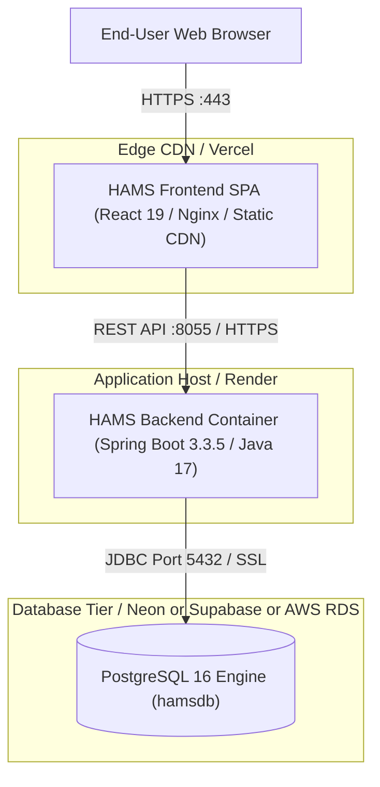

# HAMS Phase 12 — Deployment Guide

**Project:** Hospital Appointment Management System (HAMS)  
**Deployment Models:**  
1. Containerized Multi-Tier Deployment (Docker Compose)  
2. Cloud Native PaaS Deployment (Frontend on Vercel + Backend on Render + Managed PostgreSQL)  
**Status:** Verified Deployment Configurations  

---

## 1. Deployment Topology Overview



---

## 2. Docker Compose Production Deployment

The project provides an orchestrated production setup via `docker-compose.yml`.

### 2.1 Multi-Container Stack
- `postgres`: Container running `postgres:16-alpine` with healthcheck (`pg_isready`). Persistent volume `hams_postgres_data`.
- `backend`: Multi-stage build (`eclipse-temurin:17-jdk-alpine` builder -> `eclipse-temurin:17-jre-alpine` runner). Bound to port `8055`.
- `frontend`: Multi-stage build (`node:20-alpine` builder -> `nginx:alpine` runner with custom `nginx.conf`). Bound to ports `80` and `3000`.

### 2.2 Launch Commands
```bash
# Validate compose syntax
docker-compose config

# Build and run containers in background
docker-compose up -d --build

# Inspect container status and health
docker-compose ps

# View backend application logs
docker-compose logs -f backend
```

---

## 3. Cloud Deployment (Vercel + Render + PostgreSQL)

### 3.1 PostgreSQL Database Setup
1. Provision a managed PostgreSQL 16 database (Render PostgreSQL, Neon, or Supabase).
2. Note the connection details:
   - Host, Port (5432)
   - Database Name (`hamsdb`)
   - Username and Password
   - Connection URL: `jdbc:postgresql://<host>:5432/<dbname>?sslmode=require`

### 3.2 Backend Deployment on Render
1. Create a new **Web Service** on Render connected to the repository.
2. Root Directory: `hams-backend`
3. Environment: **Docker** (using `hams-backend/Dockerfile`)
4. Set Required Environment Variables in Render Dashboard:
   - `SPRING_PROFILES_ACTIVE`: `prod`
   - `PORT`: `8055`
   - `DB_URL`: `jdbc:postgresql://<host>:5432/<dbname>?sslmode=require`
   - `DB_USERNAME`: `<db_username>`
   - `DB_PASSWORD`: `<db_password>`
   - `JWT_SECRET`: `<A-32-Byte-Min-Cryptographically-Random-Base64-String>`
   - `ADMIN_EMAIL`: `admin@hams.local`
   - `ADMIN_PASSWORD`: `<StrongAdminPassword>`
   - `SEED_DEMO_DATA`: `true` (or `false` for pristine production)
5. Health Check Path: `/api/public/health`

### 3.3 Frontend Deployment on Vercel
1. Create a new Project on Vercel connected to the repository.
2. Root Directory: `hams-frontend`
3. Framework Preset: **Vite**
4. Build Command: `npm run build`
5. Output Directory: `dist`
6. Set Environment Variables:
   - `VITE_API_URL`: `https://<render-backend-subdomain>.onrender.com`
7. Ensure SPA Client Routing:
   Vercel handles React Router history mode through standard `vercel.json` rewrites:
   ```json
   {
     "rewrites": [{ "source": "/(.*)", "destination": "/index.html" }]
   }
   ```

---

## 4. Production Security & Environment Matrix

| Parameter | Development Default | Production Requirement | Purpose |
|---|---|---|---|
| `SPRING_PROFILES_ACTIVE` | `dev` | `prod` | Switches Hibernate to validate, disables debug logs |
| `PORT` | `8055` | Defined by host (`8055` or `PORT`) | Application HTTP listener port |
| `DB_URL` | `jdbc:postgresql://localhost:5432/hamsdb` | Strict JDBC URL with SSL | Database connection |
| `JWT_SECRET` | Preconfigured dev secret | **Mandatory External Env** | Signing HMAC-SHA256 tokens |
| `CORS Allowed Origins` | `http://localhost:*` | Production Vercel domain | Browser cross-origin protection |

---

## 5. Troubleshooting & Diagnostics

| Symptom | Probable Cause | Corrective Action |
|---|---|---|
| **Backend crashes on launch** | Missing `JWT_SECRET` in prod profile | Set `JWT_SECRET` with minimum 256 bits (32 characters). |
| **CORS error in browser console** | Frontend domain not in `SecurityConfig` | Add production domain to `SecurityConfig.corsConfigurationSource`. |
| **SPA 404 on refresh** | Nginx or static CDN missing fallback | Verify `try_files $uri $uri/ /index.html;` in Nginx or Vercel rewrite. |
| **Double-booking error (409)** | Conflicting appointment slot | Normal behavior — user prompted to select alternate slot. |
| **Database migration failed** | Schema drift between Flyway and tables | Check `flyway_schema_history` table for checksum mismatch. |
