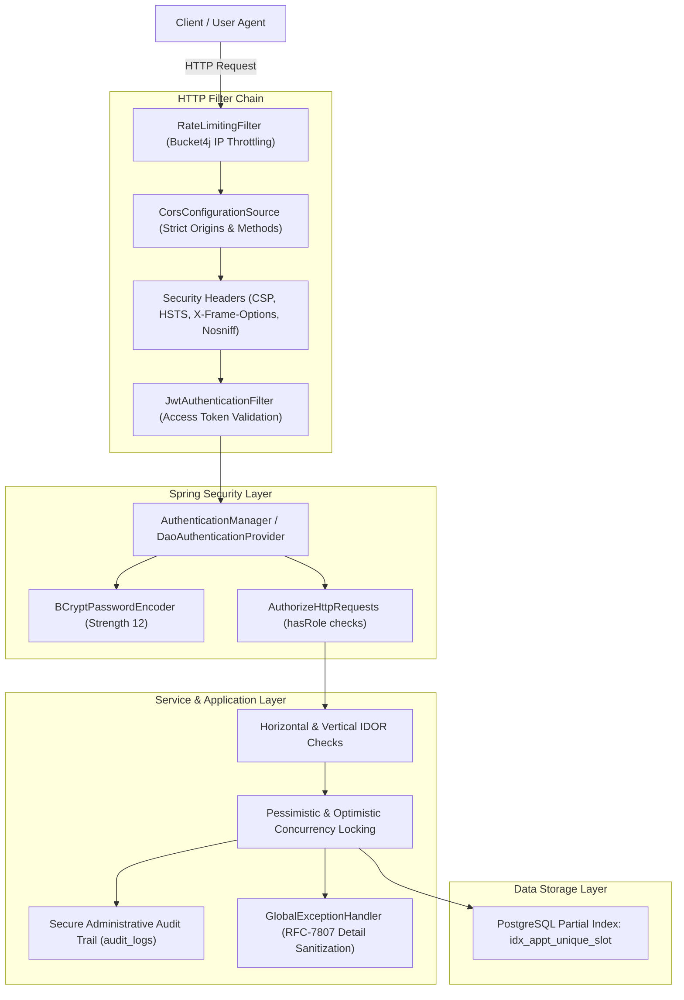

# HAMS Phase 12 — Security Architecture & Hardening Documentation

**Project:** Hospital Appointment Management System (HAMS)  
**Security Framework:** Spring Security 6, JJWT 0.12.6, BCrypt (Cost 12), Bucket4j In-Memory Limiter  
**Scope:** Verified Hardening from Phase 10 Audit  
**Status:** Verified Production-Grade Security Controls  

---

## 1. Security Architecture Overview

HAMS is engineered according to the principle of defense-in-depth, enforcing protection at the network, filter, business service, and database tiers.



---

## 2. Core Security Controls Table

| Security Control | Implementation Mechanism | Evidence / Verified Test |
|---|---|---|
| **Password Storage** | BCrypt hashing with work factor 12 | `SecurityConfig.java`, `AuthService.java` |
| **Authentication** | Dual-token JWT (Access: 15m, Refresh: 7d) | `JwtService.java`, `AuthAndRbacIntegrationTest` |
| **Token Segregation** | Access tokens rejected for refresh operations and vice versa | `JwtService.validateToken` checks claim `tokenType` |
| **Role-Based Access Control** | URL-level security mapping (`hasRole`) + `@PreAuthorize` | RBAC Matrix Test (15/15 live endpoint checks passed) |
| **Horizontal IDOR Protection** | Cross-checking `user.id` against entity ownership | `PatientService`, `DoctorService`, `AppointmentService` |
| **Brute Force Protection** | `RateLimitingFilter` (10 requests/min on `/api/auth/**`) | `RateLimitingFilter.java` (HTTP 429 response) |
| **Double-Booking Prevention** | `idx_appt_unique_slot` PostgreSQL partial unique index | `Phase5AppointmentIntegrationTest` |
| **Clickjacking Defense** | `X-Frame-Options: DENY`, CSP `frame-ancestors 'none'` | `SecurityConfig.securityFilterChain` |
| **MIME Sniffing Prevention** | `X-Content-Type-Options: nosniff` | Built-in Spring Security header writer |
| **Transport Security** | HSTS (`max-age=31536000; includeSubDomains`) | `SecurityConfig.securityFilterChain` |
| **Content Security Policy** | Strict directives restricting scripts, frames, objects | `SecurityConfig.securityFilterChain` |
| **CORS Policy** | Origin whitelisting with allowed credentials and headers | `SecurityConfig.corsConfigurationSource` |
| **Exception Sanitization** | RFC 7807 `ProblemDetail` hiding SQL/Hibernate traces | `extractApiError` & `GlobalExceptionHandler` |
| **Administrative Audit Trail** | Dedicated persistent log (`audit_logs` table) | `AuditLogService.java`, `AdminAuditController.java` |
| **Production Secret Fail-Fast** | `application-prod.yml` enforces mandatory `${JWT_SECRET}` | Verified absence of fallback secrets in prod config |

---

## 3. JWT & Session Management

### 3.1 Token Lifecycle
- **Access Token:**
  - Standard expiration: 15 minutes (`900000 ms`).
  - Claims: `sub` (User Email), `userId`, `role`, `tokenType: ACCESS`.
  - Signed using HMAC-SHA256 (`Keys.hmacShaKeyFor(secret.getBytes())`).
- **Refresh Token:**
  - Standard expiration: 7 days (`604800000 ms`).
  - Claims: `sub` (User Email), `userId`, `tokenType: REFRESH`.
  - Cannot be utilized as a Bearer authorization token on protected clinical endpoints.
- **Stateless Invalidation:**
  - Logout clears client-side tokens from `localStorage` and client memory.
  - Expired tokens return HTTP 401 with `UNAUTHORIZED` RFC-7807 error detail.

---

## 4. IDOR & Ownership Verification Architecture

In healthcare SaaS applications, role-based authorization alone does not prevent Insecure Direct Object References (e.g., Patient A fetching Patient B's prescription via `/api/patient/prescriptions/{id}`).

HAMS implements programmatic ownership assertion inside every service method:

```java
// Example from ConsultationService & PatientPrescriptionController:
Patient patient = patientRepository.findByUserId(userPrincipal.getId())
    .orElseThrow(() -> HamsException.notFound("Patient", userPrincipal.getId()));

Appointment appointment = appointmentRepository.findById(appointmentId)
    .orElseThrow(() -> HamsException.notFound("Appointment", appointmentId));

if (!appointment.getPatient().getId().equals(patient.getId())) {
    throw HamsException.forbidden("You do not have permission to view this clinical record");
}
```

This pattern is verified across:
1. Patient viewing appointment details (`/api/patient/appointments/{id}`).
2. Patient downloading prescriptions (`/api/patient/prescriptions/{id}`).
3. Doctor viewing patient charts (`/api/doctor/appointments/{id}`).
4. Doctor updating schedule availability and submitting leaves.

---

## 5. Audit Logging — Secure Administrative Audit Trail

HAMS provides accountability via the **Secure Administrative Audit Trail**. Every security-sensitive or administrative operation creates an unalterable log entry.

### 5.1 Tracked Actions
- User lifecycle: `USER_REGISTERED`, `USER_ACTIVATED`, `USER_DEACTIVATED`, `LOGIN_FAILED`.
- Doctor governance: `DOCTOR_REGISTERED`, `DOCTOR_VERIFIED`, `DOCTOR_REJECTED`.
- Appointment lifecycle: `APPOINTMENT_BOOKED`, `APPOINTMENT_CANCELLED`, `APPOINTMENT_RESCHEDULED`, `APPOINTMENT_STATUS_UPDATED`.
- Consultation events: `CONSULTATION_COMPLETED`, `PRESCRIPTION_GENERATED`.

### 5.2 Terminology & Evidence Standard
Documentation and UI explicitly refer to this subsystem as the **Secure Administrative Audit Trail**. 

> [!NOTE]  
> HAMS stores audit logs in a dedicated PostgreSQL table (`audit_logs`) indexed by user and timestamp. The system does not claim cryptographic immutability or tamper-resistance; audit entries are protected by strict application-level RBAC restricting read access solely to `ROLE_ADMIN` and preventing any HTTP `PUT`/`PATCH`/`DELETE` mutations.
