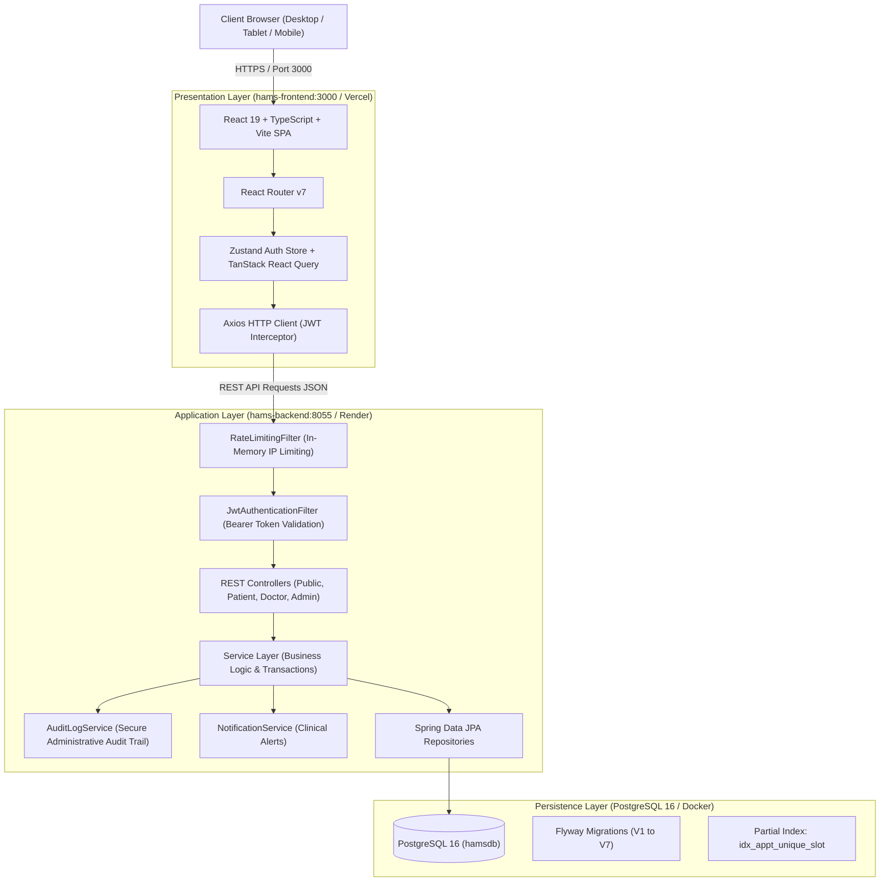
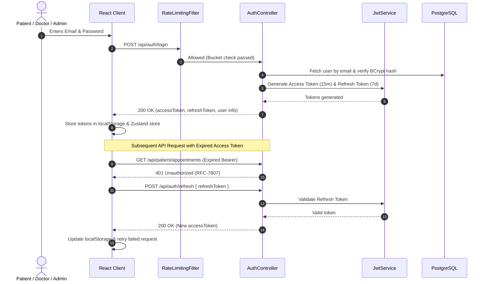
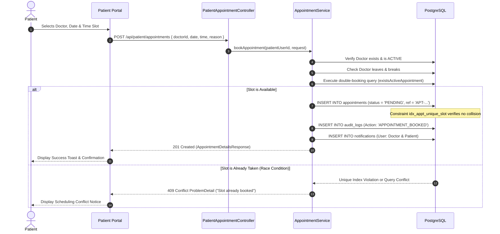
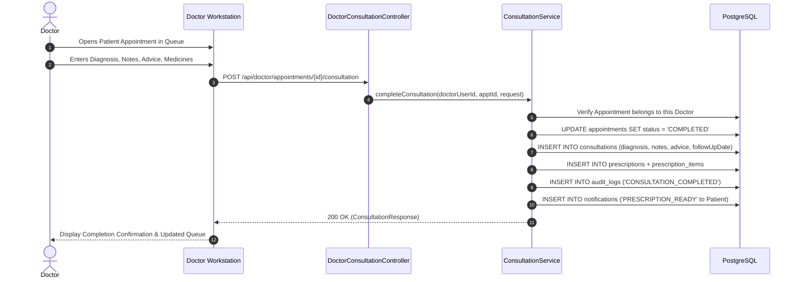

# HAMS Phase 12 — System Architecture Documentation

**Project:** Hospital Appointment Management System (HAMS)  
**Academic Context:** BCA Final-Year Project  
**Architecture Classification:** Enterprise 3-Tier Layered Architecture (SPA + REST + Relational RDBMS)  
**Status:** Verified Production Architecture  

---

## 1. System Overview

The Hospital Appointment Management System (HAMS) is a digital healthcare coordination platform engineered to manage doctor availability, patient booking workflows, clinical consultations, digital prescriptions, administrative governance, and automated notifications.

The system is constructed with strict tier decoupling:
1. **Presentation Layer:** Single Page Application (SPA) built with React 19, TypeScript, Tailwind CSS, Vite, and Framer Motion.
2. **Application & Security Tier:** Stateless Spring Boot 3.3.5 micro-ready monolithic REST service executing on Java 17/25, secured by Spring Security 6, JWT (JJWT 0.12.6), and Bucket4j-inspired rate limiting.
3. **Data Persistence Tier:** PostgreSQL 16 relational database with Flyway migration versioning (`V1`–`V7`) and declarative JPA/Hibernate auditing.

---

## 2. Layer Responsibilities & Component Architecture

### 2.1 Presentation Layer (`hams-frontend`)
- **Technology:** React 19.2.8, Vite 8.3.0, TypeScript 6.0, Tailwind CSS 3.4, Lucide React 1.52.
- **Routing & Guards:** `React Router v7` utilizes `RequireAuth` and `GuestOnly` guards enforcing role-based route separation (`PATIENT`, `DOCTOR`, `ADMIN`).
- **State Management:**
  - `authStore.ts`: Zustand store with `persist` middleware synchronizing user profile, roles, and session states with `localStorage`.
  - `@tanstack/react-query`: Caching, server-state synchronization, and automatic background invalidation.
- **HTTP Client (`src/api/client.ts`):**
  - Outgoing Request Interceptor: Injects `Authorization: Bearer <token>` into request headers.
  - Response Interceptor: Catches `401 Unauthorized` responses and executes automatic token refreshing using `/api/auth/refresh`. If refresh fails, it clears state and redirects to `/login`.
  - Clinical Error Formatter (`extractApiError`): Sanitizes low-level error traces into user-friendly clinical notices.

### 2.2 Security & Authentication Layer (`hams-backend/security`)
- **Spring Security 6:** Fully stateless session management (`SessionCreationPolicy.STATELESS`).
- **Token Segregation:**
  - Short-lived Access Token (Default: 15 minutes / 900,000 ms) containing subject, user ID, and role claim.
  - Long-lived Refresh Token (Default: 7 days / 604,800,000 ms) dedicated solely to session renewal.
- **Password Protection:** BCrypt hashing with work factor (cost) 12.
- **Rate Limiting:** `RateLimitingFilter` enforces a token-bucket rate limiter per IP address to safeguard public endpoints (`/api/auth/**`) against brute force and credential stuffing.
- **Security Headers:** Enforces Content Security Policy (CSP), HTTP Strict Transport Security (HSTS, max-age 31536000), `X-Frame-Options: DENY`, `X-Content-Type-Options: nosniff`, and `Referrer-Policy: strict-origin-when-cross-origin`.

### 2.3 Application & Business Service Layer (`com.hams.service`)
- **Transaction Boundaries:** `@Transactional` annotations ensure atomic operations across appointments, consultations, and prescriptions.
- **Ownership & IDOR Protection:** Services cross-reference `UserPrincipal.getId()` with entity ownership foreign keys (`patient.user.id`, `doctor.user.id`) prior to executing modifications.
- **Audit Logging:** Every critical administrative mutation and clinical status change is synchronously or asynchronously logged into `audit_logs` through `AuditLogService`.
- **Notification Triggering:** System lifecycle events emit real-time notifications stored in `notifications` for user consumption.

### 2.4 Persistence Layer (`com.hams.repository` & PostgreSQL)
- **Spring Data JPA & Hibernate:** Provides object-relational mapping (ORM) with entity auditing (`BaseEntity` tracking `createdAt` and `updatedAt`).
- **Database Migrations:** Managed by Flyway (`V1__init_schema.sql` through `V7__admin_notifications_reports_audit.sql`).
- **Concurrency & Partial Indexing:** Double-booking prevention enforced via PostgreSQL partial unique index `idx_appt_unique_slot` combined with pessimistic locking (`PessimisticLockException` handling).

---

## 3. End-to-End Request & Workflow Lifecycles

### 3.1 Authentication & Token Refresh Flow

### 3.2 Patient Appointment Booking & Concurrency Flow

### 3.3 Doctor Consultation & Prescription Flow

---

## 4. Architectural Boundaries & Cross-Cutting Concerns

| Concern | Implementation Mechanism | Location in Repository |
|---|---|---|
| **Logging & Telemetry** | SLF4J + Logback structured console logging | `hams-backend/src/main/resources/application.yml` |
| **Error Handling** | RFC-7807 `ProblemDetail` via `@RestControllerAdvice` | `com.hams.exception.GlobalExceptionHandler` |
| **Data Validation** | Jakarta Bean Validation (`@Valid`, `@NotBlank`, `@Size`) | `com.hams.dto.*` |
| **Auditing** | Spring Data JPA Auditing (`@EnableJpaAuditing`, `BaseEntity`) | `com.hams.entity.BaseEntity` |
| **Administrative Audit Trail** | Dedicated persistent audit service (`audit_logs` table) | `com.hams.service.AuditLogService` |
| **Containerization** | Multi-stage Dockerfiles + Docker Compose | `docker-compose.yml`, `hams-backend/Dockerfile` |
