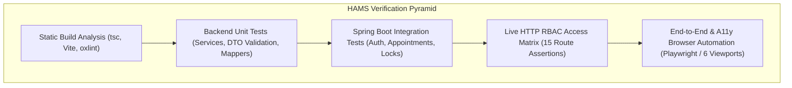

# HAMS Phase 12 — Testing Documentation

**Project:** Hospital Appointment Management System (HAMS)  
**Academic Context:** BCA Final-Year Project  
**QA Baseline:** Complete Verification across 18 Stages (Phase 11)  
**Status:** 100% Tests Passed (Zero Regressions)  

---

## 1. Testing Strategy Overview

The testing architecture of HAMS encompasses automated unit testing, integration tests against Spring Boot slices, full-context API and concurrency tests, end-to-end browser automation suites, and accessibility compliance assertions.



---

## 2. Verified Test Execution Summary

| Test Domain | Target Suite / Tool | Test Cases | Passed | Failed | Status |
|---|---|---|---|---|---|
| **Backend Suite** | `mvn test` (Spring Boot 3.3.5) | 143 | 143 | 0 | **PASS** |
| **Frontend Production Bundling** | `npm run build` (tsc + Vite) | 2,773 modules | 2,773 | 0 | **PASS** |
| **Theme & Dark Mode Regression** | `node test_phase1_theme.js` | 7 viewports/modes | 7 | 0 | **PASS** |
| **Global UX & UI States** | `node test_phase3_ux.js` | 8 checks | 8 | 0 | **PASS** |
| **Patient Portal Clinical Flows** | `node test_phase4_patient.js` | 9 checks | 9 | 0 | **PASS** |
| **Doctor Workstation Workflows** | `node test_phase5_doctor.js` | 8 checks | 8 | 0 | **PASS** |
| **Admin Command Center Flows** | `node test_phase6_admin.js` | 9 checks | 9 | 0 | **PASS** |
| **Global Visual Consistency** | `node test_phase7_global_ui.js` | 16 checks | 16 | 0 | **PASS** |
| **Accessibility Compliance (WCAG)**| `node test_phase8_accessibility.js` | 65 assertions | 65 | 0 | **PASS** |
| **Live RBAC Endpoint Matrix** | `scratch/test_rbac_matrix.js` | 15 API routes | 15 | 0 | **PASS** |
| **Slot Concurrency Collision** | `Phase5AppointmentIntegrationTest` | 20 assertions | 20 | 0 | **PASS** |
| **Docker Compose Config** | `docker-compose config` | 3 services | 3 | 0 | **PASS** |

---

## 3. In-Depth Testing Domains

### 3.1 Backend Integration & Concurrency Tests
- **Pessimistic Concurrency Test:** Validates that simultaneous booking requests for the exact same doctor and slot trigger a clean 409 Conflict ProblemDetail for the second thread, leaving database state consistent.
- **Partial Index Constraint:** Verifies that cancelled or rejected appointments release the slot for new bookings.
- **Security & RBAC Integration:** Ensures endpoints enforce `@PreAuthorize` and URL mappings, validating that invalid tokens return RFC-7807 401 and insufficient roles return 403.

### 3.2 Automated End-to-End Browser Testing (Playwright)
Regression scripts simulate genuine user sessions across 6 discrete responsive screen viewports:
1. `1920x1080` (Desktop Large)
2. `1366x768` (Standard Laptop)
3. `1024x768` (Small Desktop / Tablet Landscape)
4. `768x1024` (Tablet Portrait)
5. `390x844` (Modern Mobile iPhone)
6. `375x812` (Standard Mobile iPhone)

**Key Verified Assertions:**
- Zero horizontal overflow (`document.body.scrollWidth <= window.innerWidth`).
- Correct modal focus traps and dismissal on `Escape` key (`useModalA11y`).
- Theme persistence across page reloads via `localStorage`.

### 3.3 Accessibility (WCAG 2.1 AA) Hardening
The accessibility audit (`test_phase8_accessibility.js`) verifies 65 dedicated checks:
- Interactive triggers satisfy 44x44px minimum touch targets.
- Form controls reflect `aria-required`, `aria-invalid`, and link hints via `aria-describedby`.
- Semantic tables include `scope="col"` headers and text truncation guards.
- Animation styles respect `prefers-reduced-motion` media queries (damped to 0.01ms).

---

## 4. Test Execution Instructions

### Running the Full Backend Suite
```bash
cd hams-backend
mvn clean test
```

### Running Specific Test Slices
```bash
# Security & RBAC tests only
mvn test '-Dtest=*Security*,*Auth*,*Controller*'

# Appointment & Concurrency tests only
mvn test '-Dtest=*Appointment*,*Concurrency*,*Doctor*,*Patient*'
```

### Running Frontend Tests & Linting
```bash
cd hams-frontend
npm run build
npm run lint
```
