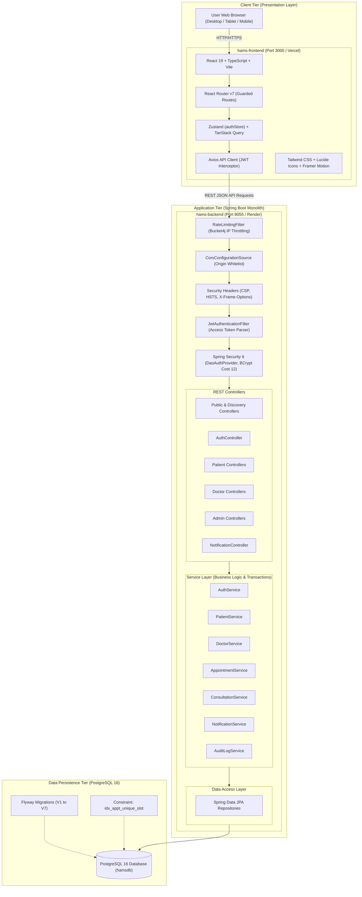
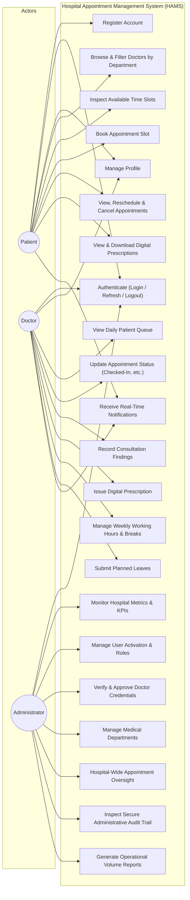
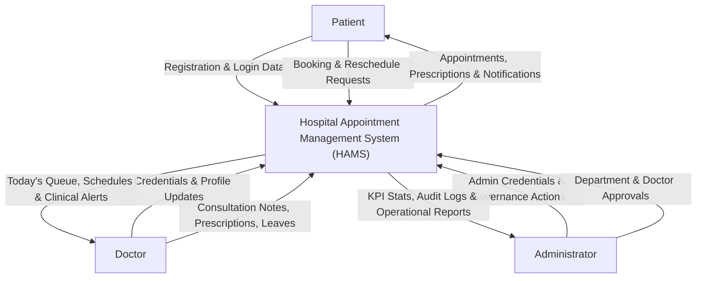
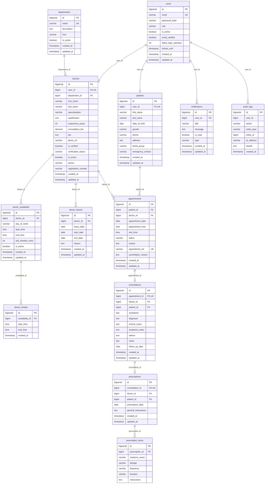
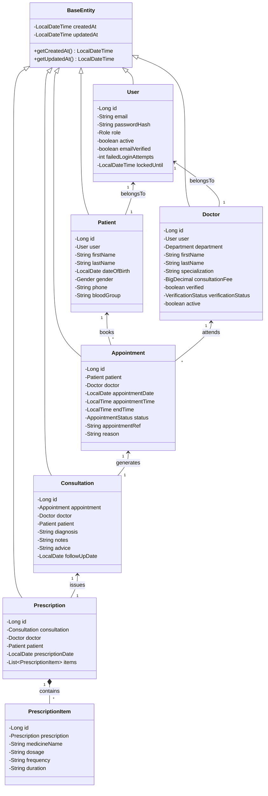
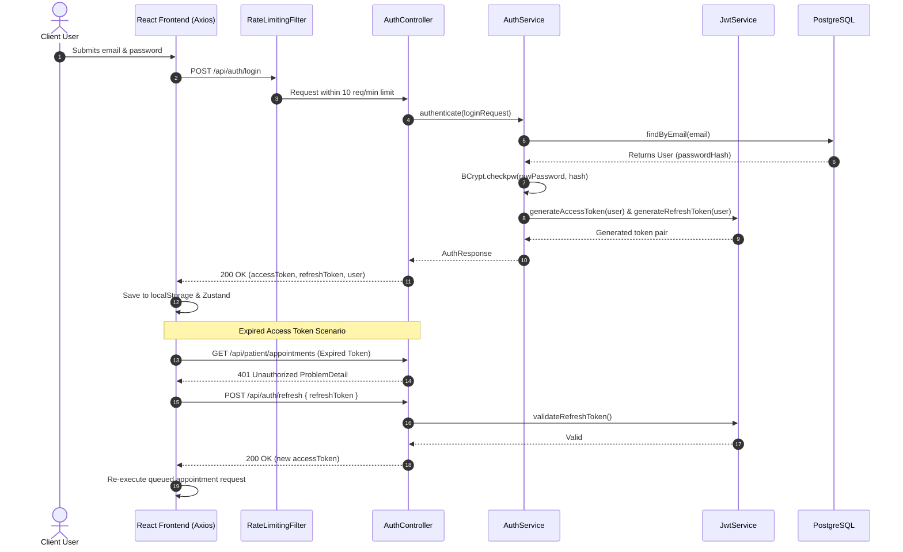
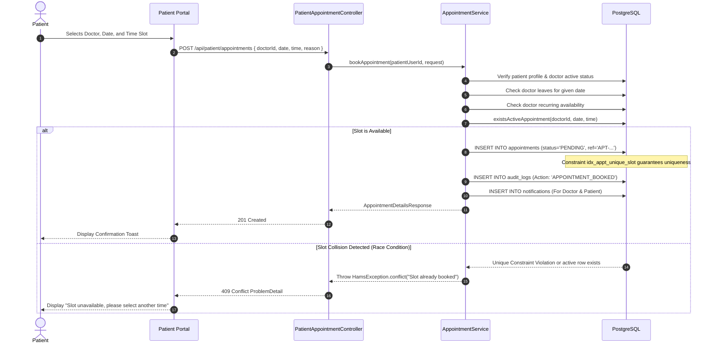
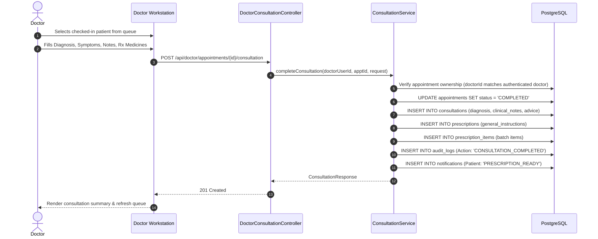
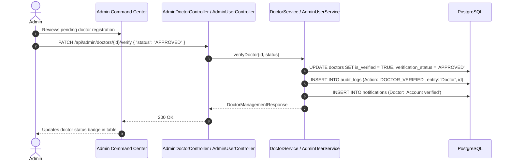
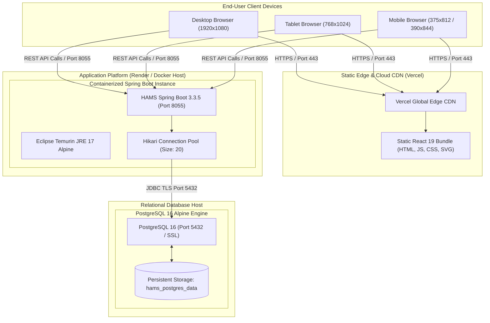

# HAMS Phase 13 — Comprehensive System Diagrams

**Project:** Hospital Appointment Management System (HAMS)  
**Academic Context:** BCA Final-Year Project  
**Specification:** Evidence-Based Mermaid Architectural & Workflow Diagrams  
**Status:** Verified Against Actual Implementation  

---

## 1. System Architecture Diagram

This diagram visualizes the actual 3-tier decoupled architecture: React Single Page Application (SPA), Spring Boot monolithic REST backend with layered security, and PostgreSQL 16 database.



---

## 2. Use Case Diagram

The use case model reflects the three supported user roles (`PATIENT`, `DOCTOR`, `ADMIN`) and their permitted functional interactions.



---

## 3. Data Flow Diagrams (DFD)

### 3.1 DFD Level 0 (Context Diagram)



### 3.2 DFD Level 1 (Major Functional Processes)

```mermaid
flowchart TD
    Patient["Patient"]
    Doctor["Doctor"]
    Admin["Administrator"]

    subgraph CoreProcesses["HAMS Level 1 Processes"]
        P1["1.0 Authentication & Token Lifecycle"]
        P2["2.0 Patient Portal Management"]
        P3["3.0 Doctor Clinical Management"]
        P4["4.0 Appointment Scheduling & Concurrency"]
        P5["5.0 Clinical Consultation & Prescription"]
        P6["6.0 Real-Time Notifications"]
        P7["7.0 Hospital Administration & Audit"]
    end

    subgraph DataStores[("Data Stores")]
        DS_Users[("D1: users")]
        DS_Patients[("D2: patients")]
        DS_Doctors[("D3: doctors / schedules")]
        DS_Appointments[("D4: appointments")]
        DS_Clinical[("D5: consultations / prescriptions")]
        DS_Notifications[("D6: notifications")]
        DS_Audit[("D7: audit_logs")]
    end

    Patient -->|Login / Credentials| P1
    Doctor -->|Login / Credentials| P1
    Admin -->|Login / Credentials| P1
    P1 <-->|Read / Write Auth Tokens| DS_Users

    Patient -->|Demographics Update| P2
    P2 <-->|Patient Details| DS_Patients

    Doctor -->|Availability & Leaves| P3
    P3 <-->|Doctor Schedule Data| DS_Doctors

    Patient -->|Slot Reservation Request| P4
    P4 <-->|Check Slots & Write Appointment| DS_Appointments
    P4 -->|Trigger Event| P6
    P4 -->|Log Action| P7

    Doctor -->|Consultation & Rx Submission| P5
    P5 <-->|Link to Appointment| DS_Appointments
    P5 -->|Write Findings & Medicines| DS_Clinical
    P5 -->|Trigger Rx Alert| P6
    P5 -->|Log Consultation| P7

    Admin -->|Governance & Verifications| P7
    P7 <-->|User & Doctor Status Updates| DS_Users
    P7 <-->|Doctor Verification Records| DS_Doctors
    P7 -->|Read Audit Records| DS_Audit
    P7 -->|Write Admin Logs| DS_Audit

    P6 -->|Deliver Alerts| DS_Notifications
    DS_Notifications -->|Unread Notices| Patient
    DS_Notifications -->|Queue Notices| Doctor
```

---

## 4. Entity Relationship (ER) Diagram

Represents all 13 PostgreSQL tables implemented via Flyway migrations (`V1` through `V7`).



---

## 5. Domain Class Diagram

This diagram displays the key backend Java domain entities, relationships, and business repositories.



---

## 6. Sequence Diagrams

### 6.1 Authentication & Token Refresh Flow



### 6.2 Appointment Booking & Concurrency Protection Flow



### 6.3 Clinical Consultation & Prescription Flow



### 6.4 Admin Governance Sequence Diagram



---

## 7. Deployment Diagram


